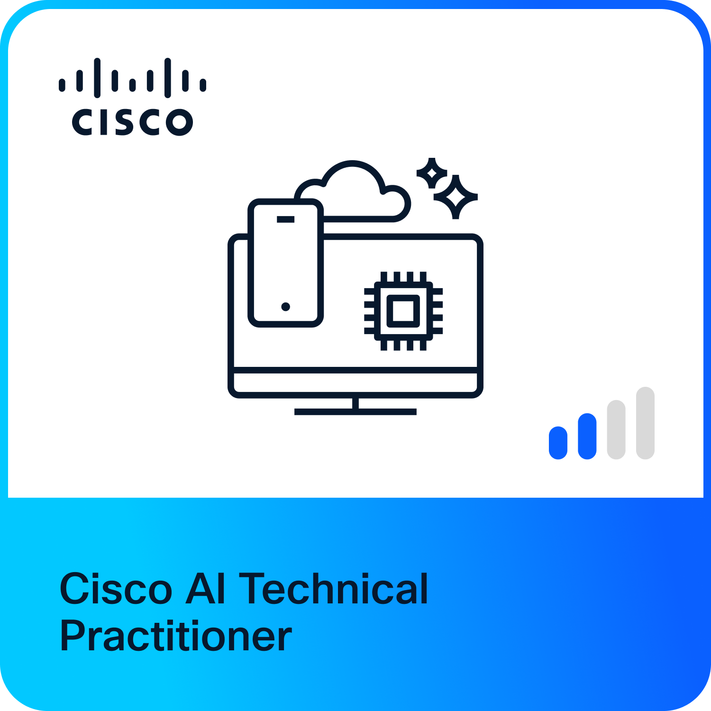

# Cybersecurity Portfolio & Training Log
    
    ## Current Progress
    * **Status:** Week 1 - Cisco AIBIZ Modules 1-4
    * **Next Goal:** ISC² Certified in Cybersecurity (CC) Exam
    
    ---
    
    ### ✅ Completed Certifications
    ### NVIDIA AI for All: From Basics to GenAI Practice
    * **Completed:** March 17, 2026
    * **Status:** Certified ✅ (Score: 100%)
    * **Proof:** 
    
    ### Cisco AI Technical Practitioner (AITECH)
    * **Completed:** March 24, 2026
    * **Status:** Certified ✅
    * **Proof:** 
    
    #### Unit Breakdown:
    * **Unit 1-4 Quizzes:** 100%
    * **Final Exam:** 100%
    
    ---
    ## My Work
    * Certifications: [View Certifications](certifications.md)
    * Training Logs:
      - Day 1: (coming soon)
      - Day 2: (coming soon)
    
